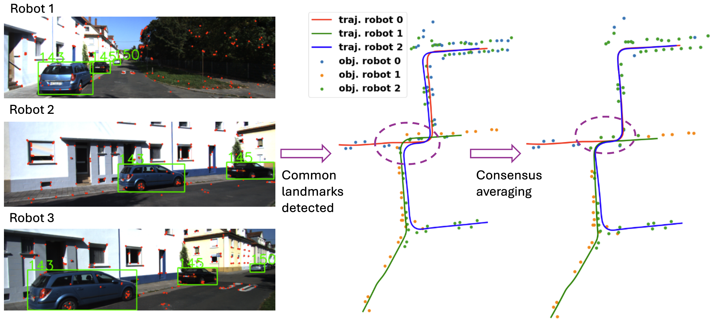

# Multi-robot Object SLAM with Distributed Variational Inference

[[Paper](https://arxiv.org/abs/2404.18331)]



## Run the code

To run the algorithm on KITTI sequence 00. Change `consensus_average` value in the corresponding [config file](params/kitti_00.yaml) to switch between original MSCKF and our propose distributed MSCKF with consensus averaging.

```shell
python run.py --dataset kitti --data_id 00
```

To run it on simulation with 15 robots. Change `consensus_average` value in the corresponding [config file](params/simulated_nrobot_15.yaml) to switch between original MSCKF and our propose distributed MSCKF with consensus averaging.
```shell
python run.py --dataset simulated --data_id nrobot_15
```

## Evaluation

To evaluate the results on KITTI sequence 00
```shell
python evaluate_results.py --dataset kitti --data_id 00
```

To evaluate the results on simulation with 15 robots
```shell
python evaluate_results.py --dataset simulated --data_id nrobot_15
```

## Citation
If you find this work useful, please consider to cite our paper:
```
@article{cao2024multi,
  title={{Multi-Robot Object SLAM using Distributed Variational Inference}},
  author={Cao, Hanwen and Shreedharan, Sriram and Atanasov, Nikolay},
  journal={arXiv preprint arXiv:2404.18331},
  year={2024}
}
```